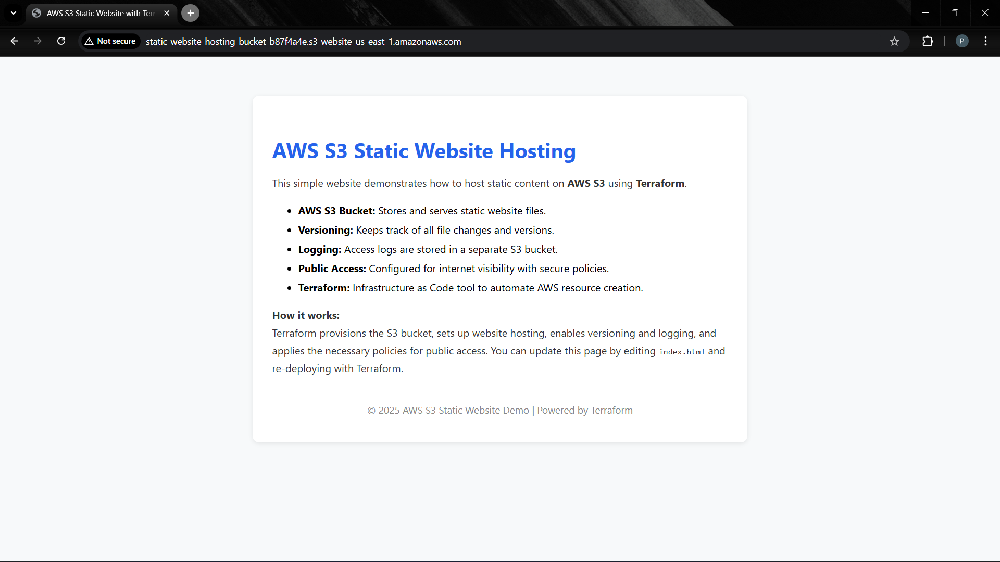

# AWS S3 Static Website Hosting with Terraform

This project uses Terraform to provision an AWS S3 bucket for static website hosting, including logging, versioning, and public access configuration.

## Features

- Publicly accessible S3 bucket for static website hosting
- Versioning enabled for the website bucket
- Logging enabled, with logs stored in a separate S3 bucket
- `index.html` as the default document
- AWS provider region set to `us-east-1`
- Bucket policy for public access
- Outputs the website endpoint URL after deployment

## Files

- `main.tf`: Terraform configuration for AWS provider, S3 buckets, policies, and website settings
- `index.html`: Basic welcome page for the static website

## Usage

1. Install [Terraform](https://www.terraform.io/downloads.html) and configure your AWS credentials.
2. Navigate to the `terraform` directory:
   ```pwsh
   cd terraform
   ```
3. Initialize Terraform:
   ```pwsh
   terraform init
   ```
4. Apply the configuration:
   ```pwsh
   terraform apply
   ```
   - Review the plan and type `yes` to confirm.
5. After deployment, find your website endpoint in the Terraform output:
   ```
   website_endpoint = "<your-bucket-name>.s3-website-us-east-1.amazonaws.com"
   ```
6. Visit the endpoint in your browser to view your static website.

## Notes

- Make sure your AWS account allows public bucket policies and does not block public access for the website bucket.
- To update the website, modify `index.html` and re-run `terraform apply`.

# My Project

This is a sample project.



## License

MIT
